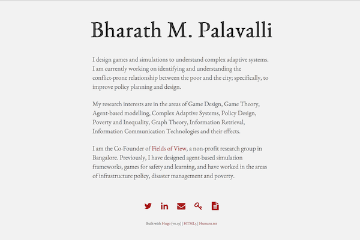

# README #

Please visit www.bharathpalavalli.com to see the live site, this are just the relevant theme files.

This is a HTML 5 compliant theme, this theme creates a landing/index page with your biography.



### What is included ###
* Modified theme specific files are in the layouts folder
* Disqus integration
* Piwik integration added
* Demosite available at https://bmp.github.io/bharathmp-hugo/


### Usage Notes ###
Bootstrap (http://getbootstrap.com) has been used for responsive UI. The theme is inspired from Andrew Codispoti's website (http://www.andrewcodispoti.com/).

Fonts
------
The website uses 'EB Garamond' as the font and is stored locally in the static folder.

Bio
------
This theme creates a landing/index page with your biography. In order to enable the text, the following parameters need to be set,

```config.toml
[params.bio]
    enable = true
    gen = ""
    research = ""
    work = ""
```
All three values will then be placed as three different parameters.

Humans.txt
------
You can add a humans.txt file to your public folder and edit it as needed for a text only, readable form.

Icons
------
Font Awesome icons (http://fontawesome.io/#) has been used for icons. In case icons aren't loading on your server, please add the following text to your .htaccess,

```script
<FilesMatch "\.(ttf|otf|eot|woff)$">
  <IfModule mod_headers.c>
    Header set Access-Control-Allow-Origin "*"
  </IfModule>
</FilesMatch>

ErrorDocument 404 /404.html
```

Piwik
------
This theme supports Piwik integration for analytics in both the Javascript form and the non-java script form.

Please set the following variables in your config file,

```config.toml
piwikSiteID = ""
piwikURL= ""
```

The javascript code is available in partials/head.html whereas the noscript version for users who have disabled javascript is available in partials/header.html.

### To-Do ###
* Add image support
* Add multiple font support
* Search integration
* ~~Create demosite on Github Pages~~
